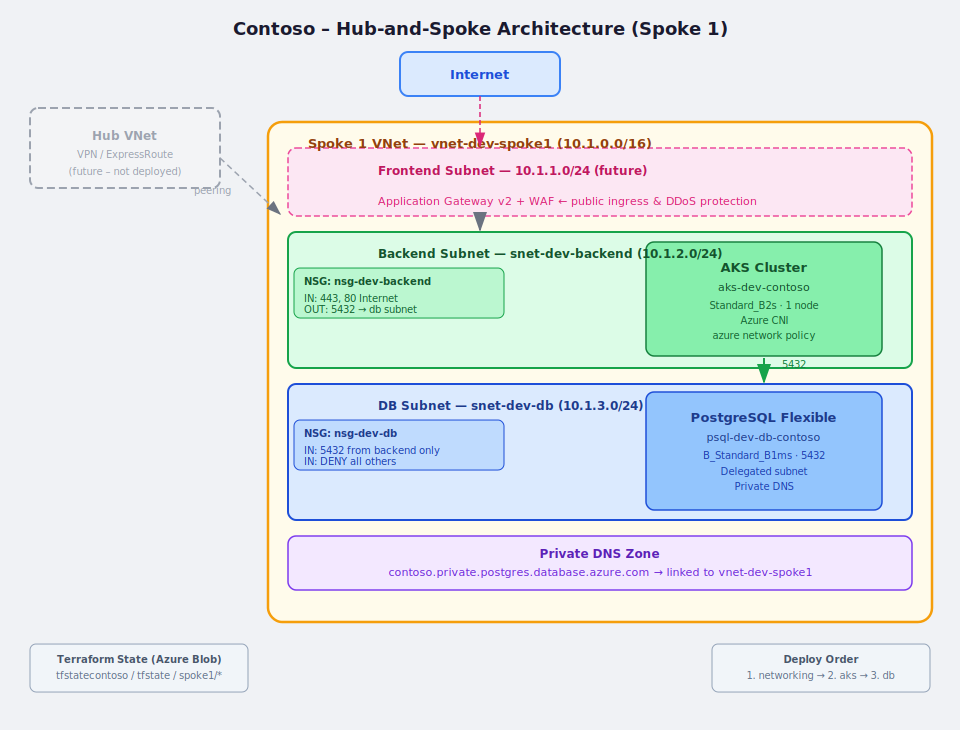

# Contoso AKS Demo — Hub-and-Spoke on Azure

Terraform infrastructure for a Contoso enterprise demo deploying AKS and PostgreSQL into an Azure Hub-and-Spoke network.

## Architecture



### Network Design

| Subnet | CIDR | Purpose |
|--------|------|---------|
| snet-dev-backend | 10.1.2.0/24 | AKS cluster nodes |
| snet-dev-db | 10.1.3.0/24 | PostgreSQL Flexible Server (delegated) |
| *(future)* snet-dev-frontend | 10.1.1.0/24 | Application Gateway v2 + WAF |

### NSG Rules

**nsg-dev-backend**
- Inbound: allow 443, 80 from Internet
- Outbound: allow 5432 to db subnet

**nsg-dev-db**
- Inbound: allow 5432 from backend subnet only
- Inbound: deny everything else

---

## Repository Structure

```
modules/
  aks/v01/              # AKS module
  database/v01/         # PostgreSQL Flexible Server module
  networking/v01/       # VNet, subnets, Network Watcher
  networking/nsg/v01/   # NSG module

spoke1/
  networking/dev/       # VNet + NSGs
  aks/dev/              # AKS cluster for dev
  db/dev/               # PostgreSQL for dev

env_files/              # Local credential scripts (gitignored)
.github/workflows/      # CI/CD pipeline
```

---

## Prerequisites

- [Terraform](https://developer.hashicorp.com/terraform/downloads) >= 1.5 or [OpenTofu](https://opentofu.org/docs/intro/install/) >= 1.5 (commands below use `tofu`, replace with `terraform` if needed)
- [Azure CLI](https://learn.microsoft.com/en-us/cli/azure/install-azure-cli) >= 2.50
- [kubectl](https://kubernetes.io/docs/tasks/tools/)
- Azure subscription with `Contributor` + `User Access Administrator` access (required for AKS subnet role assignment)
- Terraform state backend provisioned:
  - Resource group: `rg-terraform-state`
  - Storage account: `tfstatecontoso`
  - Blob container: `tfstate`

---

## Service Principal Setup

Terraform authenticates to Azure using a Service Principal. Create it once before the first deploy.

### Create the SP

```bash
az login

# Create SP with Contributor role
az ad sp create-for-rbac \
  --name "sp-terraform-contoso" \
  --role "Contributor" \
  --scopes "/subscriptions/<your-subscription-id>" \
  --output json
```

Save the output — you will need `appId` (= CLIENT_ID) and `password` (= CLIENT_SECRET).

### Grant additional role (required for AKS subnet role assignment)

```bash
az role assignment create \
  --assignee "<appId-from-above>" \
  --role "User Access Administrator" \
  --scope "/subscriptions/<your-subscription-id>"
```

### Configure env_files

```bash
cp env_files/tf-spoke1.sh.example env_files/tf-spoke1.sh
# Edit tf-spoke1.sh and fill in:
#   SUBSCRIPTION_NAME — your subscription name
#   ARM_CLIENT_ID     — appId from sp create-for-rbac output
#   ARM_CLIENT_SECRET — password from sp create-for-rbac output
```

> `env_files/tf-spoke1.sh` is gitignored and never committed to the repository.

---

## CI/CD — GitHub Actions

The workflow `.github/workflows/deploy.yml` is triggered manually via **Actions → Run workflow** in GitHub.

### Pipeline flow

```
validate (fmt + tofu validate)
        ↓
networking (plan → apply)
        ↓
aks (plan → apply)
        ↓
db (plan → apply)
```

### Manual dispatch inputs

| Input | Default | Description |
|---|---|---|
| `spoke` | `spoke1` | Which spoke to deploy |
| `environment` | `dev` | Target environment (dev, prod, …) |
| `modules` | `["networking","aks","db"]` | Ordered list of modules to deploy |

### GitHub Secrets

Set the following secrets in **GitHub repo → Settings → Secrets and variables → Actions**:

| Secret | Value |
|---|---|
| `ARM_CLIENT_ID` | SP `appId` |
| `ARM_CLIENT_SECRET` | SP `password` |
| `ARM_TENANT_ID` | Azure tenant ID |
| `ARM_SUBSCRIPTION_ID` | Azure subscription ID |
| `ARM_ACCESS_KEY` | Storage account key for Terraform state |
| `TF_VAR_DB_ADMIN_PASSWORD` | PostgreSQL admin password |

Get the storage account key:

```bash
az storage account keys list \
  -g rg-terraform-state \
  -n tfstatecontoso \
  --query "[0].value" -o tsv
```

---

## Deploy

### 1. Login to Azure

```bash
az login
source env_files/tf-spoke1.sh
```

### 2. Set PostgreSQL password

```bash
export TF_VAR_db_admin_password="<your-strong-password>"
```

### 3. Deploy networking (VNet, subnets, NSGs)

```bash
cd spoke1/networking/dev
tofu init
tofu apply
```

### 4. Deploy AKS

```bash
cd spoke1/aks/dev
tofu init
tofu apply
```

### 5. Deploy PostgreSQL

```bash
cd spoke1/db/dev
tofu init
tofu apply
```

---

## Test

### Verify AKS

```bash
cd spoke1/aks/dev
tofu output -json kubeconfigs | jq -r '.contoso' > ~/.kube/contoso-aks
chmod 600 ~/.kube/contoso-aks
export KUBECONFIG=~/.kube/contoso-aks
kubectl get nodes
kubectl get pods -A
```

### Verify PostgreSQL is reachable from AKS

```bash
kubectl run psql-test --rm -it --image=postgres:16 -- \
  psql "host=$(cd ../../db/dev && tofu output -json postgresql_fqdns | jq -r '.["db-contoso"]') \
        port=5432 dbname=postgres user=psqladmin sslmode=require"
```

### Verify NSG rules

```bash
az network nsg show \
  -g rg-dev-spoke1 \
  -n nsg-dev-backend \
  --query "securityRules[].{name:name,priority:priority,direction:direction,access:access,port:destinationPortRange}" \
  -o table

az network nsg show \
  -g rg-dev-spoke1 \
  -n nsg-dev-db \
  --query "securityRules[].{name:name,priority:priority,direction:direction,access:access,port:destinationPortRange}" \
  -o table
```

---

## Cleanup

```bash
# Destroy in reverse order
cd spoke1/db/dev && tofu destroy
cd spoke1/aks/dev && tofu destroy
cd spoke1/networking/dev && tofu destroy
```

---

## Interview Questions

### How would you publish the app to the internet?
Add an **Application Gateway v2 + WAF** in the frontend subnet (`10.1.1.0/24`). Traffic flows:
`Internet → App Gateway (WAF) → AKS (backend subnet) → PostgreSQL (db subnet)`

### How would you protect publicly facing apps?
- **WAF** on Application Gateway — OWASP rules, bot protection
- **NSG** on frontend subnet — restrict inbound to 443/80 only
- **Azure DDoS Protection Standard** on the VNet
- **Private endpoints** — PostgreSQL never exposed to internet (VNet injection + private DNS)
- **TLS everywhere** — enforce HTTPS at App Gateway level
